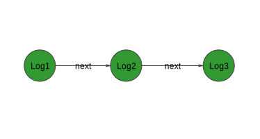

# Логирование

Из-коробки библиотека позволяет логировать любую операцию, которая осущеставляется узлом. 

Для хранения информации используется проткол [Logable](https://lastsprint.dev/CoreNetKit/Docs/swift_output/Protocols/Logable.html)

По-умолчанию в качестве реализации этого протокола используется [Log](https://lastsprint.dev/CoreNetKit/Docs/swift_output/Structs/Log.html)

Выводом логов в консоль занимается [LoggerNode](https://lastsprint.dev/CoreNetKit/Docs/swift_output/Classes/LoggerNode.html)

## Как работает логирование

**В этой библиотеке по-умолчанию вывод логов происходит централизованно!**

Лог сам по себе представляет узел связного списка. Он имеет указатель на следующий лог. 



Каждый узел записывает некоторую информацию о своей работе в объект типа `Logable`. 
Далее лог работы "прикрепляется" к предыдущему логу и передается по цепочку наверх при помощи метода [log(:)](https://lastsprint.dev/CoreNetKit/Docs/swift_output/Classes/Observer.html#/s:10CoreNetKit8ObserverC3logyACyxGXDAA7Logable_pSgF) у `Observer`.

Логи "собираются" с каждого узла, а затем, после завершения работы цепочки выводится в консоль. 


Обычно логи записываются в порядке обратном порядку узлов, однако, в общем случае такое поведение не гарантируется, потому что некоторые узлы оканчивают свою работу уже после того, как был возвращен `Observer`.

## Вывод логов

Для того, чтобы выводить лог в консоль используется узел `LoggerNode`. 

Он помещается в самое начало цепочки и выводить сообщение только тогда, когда произошло одно из следующих событий:
1. `onCompleted`
2. `onError`
3. `onCancelled`

В теории можно поместить логирующий узел между всеждым из узлов цепочки, но тогда ее форимирование будет просто огромным.

У этого узла предусмотрен режим фильтрации логов.

Она выполняется по полю `id` у `Logable`. По-умолчанию он равен имени узла, создавшего лог. 
По-умолчанию фильтр пуст и в консоль выводятся все сообщения. 
Для того, чтобы избавиться от какого-то из логов, то можно добавить узел в фильтр, а имя узла можно получить так: `CustomNode.objectName`

По-умолчанию логи выводятся в следующем формате:
```
<<<===\(NodeName)===>>>

log message separated by \r\n and \t

```

Для собственных логов можно кастомизировать формат по собственному желанию.

## Пример

Рассмотрим пример записи лога.

```Swift

func process(_ data: Input) -> Observer<Output> {
    let log = Log(self.logViewObjectName, id: self.objectName)

    // some operation with data

    log += "oparetion result"

    return self.next.process(data).log(log)
}

```

Здесь мы в начале создаем объект лога, инициаллизируя его сообщением `<<<===\(self.objectName)===>>>` и передавая в качестве id имя этого узла.

Затем добавлем сообщение об операции над данными и после записываем лог.

## Логирующие узлы

Из-коробки логируют свою работу следующие узлы:

1. `RequestCreatorNode`
2. `RequestSenderNode`
3. `ResponseProcessorNode`
4. `ResponseDataPreprocessorNode` 
5. `ResponseHttpErrorProcessorNode`
6. `ResponseDataParserNode`