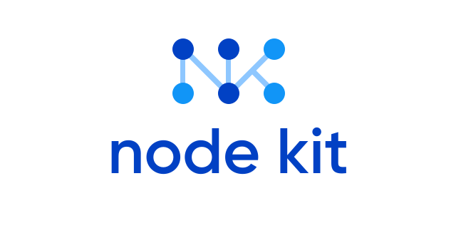
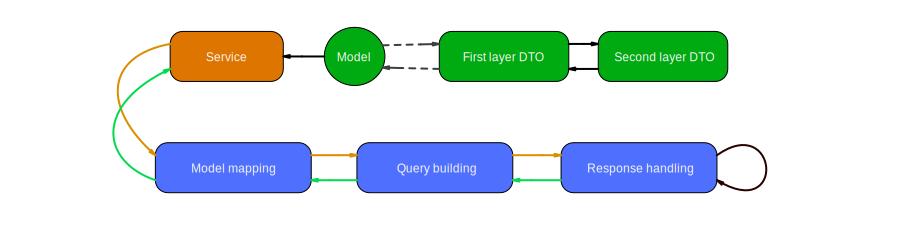

# NodeKit

[](https://github.com/surfstudio/NodeKit/actions)
[](https://codecov.io/gh/surfstudio/NodeKit)
[](https://github.com/apple/swift-package-manager)

Flexible and customizable network library

---
<p align="center">
  
</p>

## About

The NodeKit library enables rapid and easy creation of requests of varying complexity. The system operates on the principle of asynchronous data transformation, wherein nodes are interconnected to form a chain that transforms input data into a server response.



Such an approach allows us to flexibly adapt to a wide range of requirements.

## Build request using Swift Concurrency

```Swift

import NodeKit

// Define endpoints
enum Endpoint: URLRouteProvider {
    case auth

    func url() throws -> URL {
        switch self {
        case .auth:
            return URL(string: "http://nodekit.com/auth")!
        }
    }
}

// Build async request that takes AuthModel
func requestCredentials(authModel: AuthModel) async -> NodeResult<Credentials> {
    return await URLChainBuilder<Endpoint>()
        .route(.post, .users)
        .encode(as: .urlQuery)
        .build()
        .process(authModel)
}

```

## Build request using Combine

```swift

func credentialsPublisher(for authModel: AuthModel) -> AnyPublisher<NodeResult<Credentials>, Never> {
    return URLChainBuilder<Endpoint>()
        .route(.post, .users)
        .encode(as: .urlQuery)
        .build()
        .nodeResultPublisher(for: authModel)
}

```

## Installation

### Swift Package Manager

Using Xcode:

- Go to File > Swift Packages > Add Package Dependency
- Enter the URL of repository https://github.com/surfstudio/NodeKit.git

Using Package.swift file:

Write dependency: 

```swift
dependencies: [
    .package(url: "https://github.com/surfstudio/NodeKit.git", .upToNextMajor(from: "5.0.0"))
]
```

## Features

- Swift Concurrency
- Combine
- MultipartFormData
- URL QUERY / JSON / FORM URL Parameter Encoding
- Mapping JSON to Struct or Class Models
- Token refresher
- URLCach reader and writer
- Comprehensive Unit and Integration Test Coverage
- Mock target for Unit tests
- [Documentation](TechDocs/Documentation.md)
- [Code documentation](https://surfstudio.github.io/NodeKit/documentation/nodekit)

## Contributing

If you want to contribute to NodeKit, please read the [guide](TechDocs/ContributionGuide.md) beforehand.

## Changelog

The list of changes you can found [here](CHANGELOG.md).

## License

NodeKit is released under the MIT license. See [LICENSE](LICENSE) for details.
