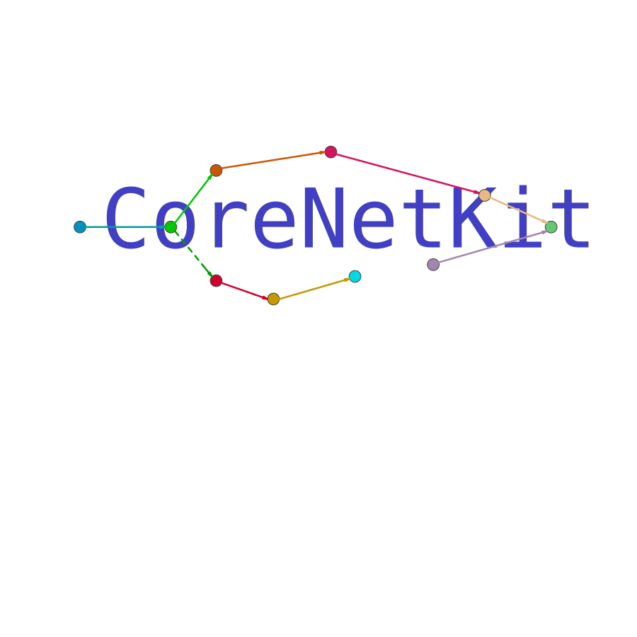
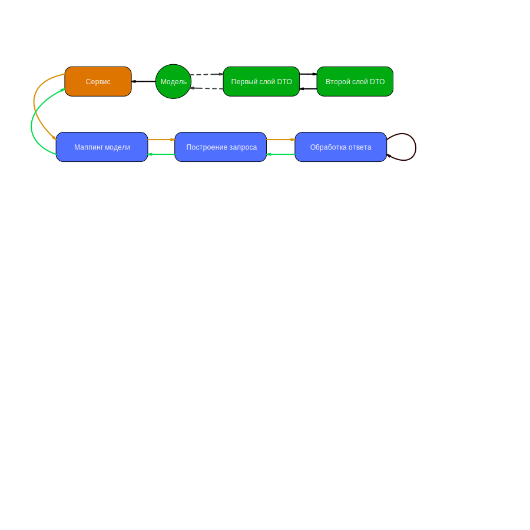

[](https://codebeat.co/projects/github-com-surfstudio-nodekit-master)
[](https://codecov.io/gh/surfstudio/NodeKit)
---
<p align="center">
  
</p>

# Гибкая и полностью кастомизируемая библиотека для работы с сетью.

Архитектура библиотеки представляет из себя граф узлов, где узел представляет из себя операцию по преобразовании входных данных. Таким образом мы преобразуем входные данные в ответ от сервера с помощью цепочки узлов. И такое преобразование может быть сколько угодно сложным. 
Причем подразумевается, что каждый отдельный узел может исполнятся в каком-то другом потоке.



Такая архитектура позволяет гибко подстраиватья под самые разные требования в рамках одного проекта. 
При этом с точки зрения API все выглядит прозрачно

# Как начать

Самый простой вариант:

```Swift

import NodeKit

enum Endpoint: UrlRouteProvider {
    case loadData

    func url() throws -> URL {
        switch self {
        case .loadData: return try .from("https://http2.pro/api/v1")
        }
    }
}

func makeRequest() -> Observer<Void> {
    return UrlChainsBuilder()
        .default(with: .init(method: .post, route: Endpoint.loadData))
        .process(["key": "value"])
}

```
Это только пример 🙂 (так делать не надо)

У нас есть [гайд](Docs/GettingStarted.md). 
Так же в проекте есть песочницы:
- [Несколько простых примеров](SimpleExample.playground)
- [Загрузка PDF](LoadPdfPlayground.playground)

# Интересные кейсы

## Проблема с маппингом

На одном из проектов был случай, связанный с маппингом ответов.

Более 30 методов работали по следующей схеме:

```
Code 200 ->
Body:
{
    #some data
}
```
В случае ошибки же
```
Code 400 ->
Body:
{
    code: int,
    message: string
}

```
Затем требования изменились и все новые методы (которые будут созданы) будут работать по другой схеме:

Успех:
```
Code 200 ->
Body:
{
    #some data
}
```

Ошибка:

```
Code 200 ->
Body:
{
    "error": {
        code: int,
        message: string
    }
}
```

Соответственно нам необходимо поддерживать сразу две схемы маппинга. 

Эта задача очень просто решилась добавлением всего одного узла в слой траспорта, который определял что нужно замапить.
Ошибку или данные. 

## Repeat

Было требование для определенных полей ввода организовывать "повторение запроса до успеха". 
Пользователь вводил данные в эти поля и мы должны были стучаться на сервер до тех пор, пока он не даст нам ответ. 

И эта проблема решилась тоже очень просто. Достаточно было написать узел, который в случае ошибки тротлил выполнение цепочки, а затем повторял запрос. 

# Документация

[Contribution Guide](/Docs/ContributionGuide.md)

[Как этим пользоваться](/Docs/Usage.md)

[Как работает библиотека](/Docs/Nodes/Basic.md)

[Существующие узлы](/Docs/Nodes/Existing.md)

[Реализованные цепочки](/Docs/Chains.md)

[Про использование моделей](/Docs/Models.md)

[Логирование](/Docs/Log/Log.md)

[Конексты и наблюдатели](/Docs/Contexts.md)

[Документация кода](https://lastsprint.dev/CoreNetKit/Docs/swift_output/)

