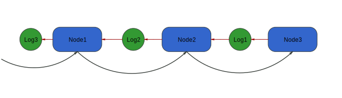

# Logging

Out of the box, the library allows logging any operation performed by a node.

## How logging works

The NodeKit library provides the ability to write logs using storage [LoggingContextProtocol](https://surfstudio.github.io/NodeKit/documentation/nodekit/loggingcontextprotocol). The built-in implementation of `LoggingContextProtocol` is [LoggingContext](https://surfstudio.github.io/NodeKit/documentation/nodekit/loggingcontext).
`LoggingContext` is created when the `process(_ data: Input)` method of the chain is called and is passed to all nodes through the `process(_ data: Input, logContext: LoggingContextProtocol)` method. Thus, each node has the ability to work with the same `LoggingContext`.

The data type that `LoggingContextProtocol` stores is [LogableChain](https://surfstudio.github.io/NodeKit/documentation/nodekit/logablechain), implemented in the structure [LogChain](https://surfstudio.github.io/NodeKit/documentation/nodekit/logchain). 
To add a new log, you need to create a `LogChain` object and pass it to `LoggingContextProtocol` using the `add` method.

The log itself represents a linked list:


This allows us to output logs in the correct order:



## Logging Output

The [LoggerNode](https://surfstudio.github.io/NodeKit/documentation/nodekit/loggernode) is responsible for logging output to the screen.
It is placed at the very beginning of the chain and outputs the message only after the entire chain has finished its work.

The node has a log filtering mode.
It is based on the `id` field of `LogableChain`. To exclude a specific log, you can add the node to the filter.

By default, logs are output in the following format:
```
<<<===\(NodeName)===>>>

log message separated by \r\n and \t

```

Custom formatting for custom logs is possible according to personal preferences.
You can configure logging in the `URLChainsBuilder`. More details about this can be found [here](../Chains.md).

### Example

Let's consider an example of logging.

```Swift

func process(_ data: Input, logContext: LoggingContextProtocol) async -> NodeResult<Output> {
    var log = LogChain("process started", id: objectName)

    // some operation with data

    log += "operation result"

    logContext.add(log)

    return await next.process(data)
}

```

Here, at the beginning, we create a LogChain object, initializing it with the message `process started` and passing the name of this node as its id.

Then, we add a message about the data operation, and finally, we write the log.

## Proxying

It is also possible to proxy logs to your own object. To do this, you need to create an object and inherit from the [LoggingProxy](https://surfstudio.github.io/NodeKit/documentation/nodekit/loggingproxy) protocol. Then, you need to pass this object to `URLChainBuilder`. After setting up LoggingProxy in the URLChainBuilder, the LoggerNode will stop printing logs to the console and will redirect the logs to the LoggingProxy.

The object inherited from `LoggingProxy` in the `handle` method receives a [LogSession](https://surfstudio.github.io/NodeKit/documentation/nodekit/logsession) actor from which you can retrieve request data (such as method and route), and also subscribe to receive logs for that request.

### Example

```Swift
struct NodeKitLoggingProxy: LoggingProxy {
	func handle(session: LogSession) {
		Task {
			let method = await session.method
			let route = await session.route
			await session.subscribe { logs in
				...
			}
		}
	}
}
```

```Swift
let loggingProxy = NodeKitLoggingProxy()

await chainBuilder
	.set(loggingProxy: loggingProxy)
	.route(.get, .users)
	.build()
	.process()
```